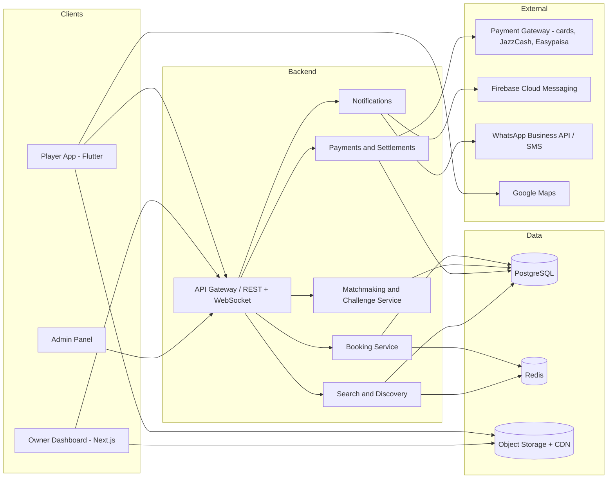
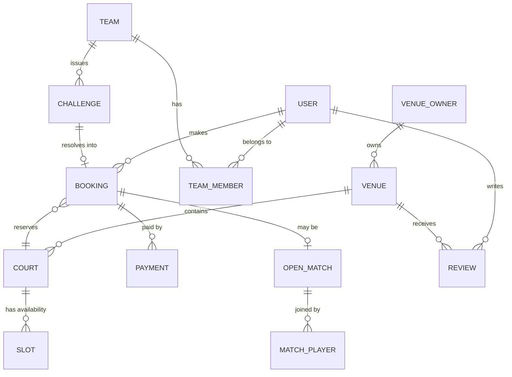

# Technical Architecture & Stack

**Status:** Draft v1 — 23 Aug 2026
**Context:** Android-first mobile app + venue-owner dashboard + backend, built by a small team, optimized for Pakistan's network conditions and payment rails.

---

## 1. Guiding Constraints

1. **Small team, fast iteration** → one codebase for mobile, managed infrastructure, boring proven tech.
2. **Pakistan network reality** → 3G/4G with dead zones; API payloads small, caching aggressive, retries idempotent.
3. **Android-heavy market (~95%)** → Android is the quality bar; iOS ships from the same cross-platform codebase.
4. **Real-money bookings** → slot integrity (no double-booking) and payment reconciliation are the two things that must never break.

## 2. Recommended Stack

| Layer | Choice | Why |
|---|---|---|
| Mobile app | **React Native (Expo)** — *decided, Aug 2026* | Single codebase → Android + iOS. This doc originally recommended Flutter and named React Native as the alternative "if the team is JS-heavy"; the team is, and the app in this repo is built on Expo SDK 57 / RN 0.86. Flutter's low-end Android edge is real but not decisive at this scale |
| Owner dashboard | **Next.js (React) web app**, responsive | Owners often manage from a laptop or a cheap tablet at the venue counter; a responsive web app avoids maintaining a third client at MVP |
| Backend API | **Node.js (NestJS) or Django** — pick by team skill | Batteries-included framework with auth, ORM, admin panel (Django admin is a free internal ops tool) |
| Database | **PostgreSQL** | Relational integrity for bookings/payments; `EXCLUDE` constraints / unique indexes make double-booking prevention a database guarantee, not just app logic |
| Cache / locks | **Redis** | Slot holds during checkout (5-min TTL locks), feed caching, rate limiting |
| Realtime | **WebSockets (or Firebase Cloud Messaging-driven refresh)** | Live calendar updates in the owner dashboard, match chat |
| Push | **Firebase Cloud Messaging** | Standard for Android push |
| Chat | Build minimal in-house on WebSockets, or **Stream/Sendbird** if budget allows | Match/challenge chat is scoped and ephemeral; don't over-invest at MVP |
| Storage/CDN | **S3-compatible + CDN (Cloudflare)** | Venue photos are the heaviest asset; serve resized WebP |
| Hosting | **Managed cloud (Railway/Render/Fly.io at MVP → AWS later)** | No local-hosting requirement at MVP; keep ops near zero |
| Payments | **Local aggregator gateway (e.g. Safepay / PayFast / XPay)** covering cards + JazzCash + Easypaisa, plus direct JazzCash/Easypaisa APIs later for lower fees | One integration at MVP; see business model doc for fee comparison |
| Maps | Google Maps Platform | Venue pins, directions; cache geocodes to control cost |
| Analytics | Firebase Analytics + Mixpanel (or PostHog self-hosted) | Funnel: install → search → booking → repeat |
| Crash/monitoring | Sentry + Firebase Crashlytics | |
| WhatsApp/SMS | WhatsApp Business API via a BSP (e.g. Twilio/360dialog) + local SMS fallback for OTP | Booking confirmations on WhatsApp are near-mandatory UX in Pakistan |

## 3. High-Level Architecture

> Note: "services" above are logical modules inside **one monolith** at MVP. Do not build microservices for launch — a modular monolith with clean module boundaries is faster to build and easy to split later.

## 4. Core Domain Model (simplified)

Key tables & fields (abbreviated):

- **venues**: owner_id, name, city, area, geo, sports[], amenities[], photos[], status(pending/verified/live), cancellation_policy
- **courts**: venue_id, sport, format (5v5/7v7/padel-double), surface, indoor, base_price, peak_rules(jsonb)
- **bookings**: court_id, user_id/team_id, start_at, end_at, status, price, advance_paid, source(app/manual), cancellation_snapshot
  - DB-level guarantee: `EXCLUDE USING gist (court_id WITH =, tsrange(start_at, end_at) WITH &&)` on active bookings → double-booking becomes impossible by construction
- **open_matches**: booking_id, host_id, sport, format, needed, skill_level, per_player_price, gender_pref, status
- **match_players**: match_id, user_id, status(requested/approved/paid/attended/no_show)
- **teams / team_members / challenges**: challenge has type(open/direct), stake_note, status, agreed_booking_id, reported_scores (both captains)
- **payments**: booking_id, provider, provider_ref, amount, type(advance/full/share), status, payout_batch_id
- **payouts**: owner_id, period, gross, commission, net, status
- **reliability_events**: user_id, type(no_show/late_cancel/attended), weight → materialized reliability score

## 5. The Two Hard Problems

### 5.1 Slot integrity (no double-booking)
1. Player opens checkout → `SETNX` Redis lock `hold:{court}:{slot}` with 5-min TTL → slot shows "held" to others.
2. Payment succeeds → insert booking inside a transaction; the Postgres exclusion constraint is the final referee.
3. Manual/walk-in bookings from the owner dashboard go through the same path — one source of truth.
4. All booking writes idempotent via client-generated `booking_intent_id` (flaky networks → users retry; retries must not double-charge or double-book).

### 5.2 Payment reconciliation
- Every gateway webhook stored raw in `payment_events` before processing (replayable).
- A booking is only `confirmed` on verified webhook, not on client callback.
- Daily reconciliation job: gateway settlement report vs our ledger; mismatches flagged to admin.
- Refunds follow the cancellation-policy snapshot stored **on the booking at creation time** (policy changes must not retroactively alter existing bookings).

## 6. Security & Privacy Basics

- Phone+OTP auth (rate-limited, device-bound refresh tokens), optional Google sign-in.
- Phone numbers never exposed between players; all coordination through in-app chat.
- Role-based access (player/captain/owner/admin); owners see only their venues.
- PCI scope stays entirely with the gateway (no card data touches our servers).
- Media upload scanning + review moderation queue.

## 7. Environments & Delivery

- `dev` → `staging` (gateway sandbox) → `production`.
- CI/CD: GitHub Actions — tests + lint on PR, Play Store internal track on merge, staged rollouts.
- Feature flags (e.g. Unleash/Firebase Remote Config) for city-by-city and feature-by-feature rollout.
- Backups: automated daily Postgres snapshots + point-in-time recovery; payment events immutable.

## 8. Build Order (engineering roadmap)

| Phase | Weeks | Deliverable |
|---|---|---|
| 0 | 1–2 | Repo, CI, auth (OTP), venue/court/slot schema, seed admin panel |
| 1 | 3–8 | Booking engine + payments + owner calendar (web) + player app booking flow → **closed pilot with 5–10 venues** |
| 2 | 9–12 | Open matches + match chat + reliability score → public launch in city 1 |
| 3 | 13–16 | Teams + challenges + leaderboard; iOS build; Urdu copy pass |
| 4 | 17+ | Tournaments/leagues, computed skill ratings, split payments, city 2 |
